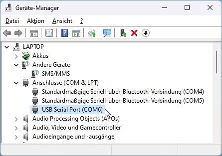

[](https://github.com/htl-rankweil/megacard)  [](https://www.gnu.org/licenses/gpl-3.0)

# Megacard

## Libraries

Easy to use libraries can be found in following directories

* [Libraries for ATmega16A integrated peripherals](./library/)
* [Libraries for External Hardware](./external/)

---

## Setup avrdude with Microchip Studio (Megacard > v4)

Download Avr Dude [`avrdude-v?.?-windows-x64.zip`](https://github.com/avrdudes/avrdude/releases/download/v7.2/avrdude-v7.2-windows-x64.zip) and [Microchip Studio 7](https://www.microchip.com/en-us/tools-resources/develop/microchip-studio#Downloads)

Copy avr-dude to a preferred path (e.g. `C:\Tools\avrdude`) and setup `External Tools` in Microchip Studio 7.


``` bash
# Title
AVR Dude
# Command (Private)
C:\Tools\AvrDude\avrdude.exe
# Command (School)
P:\lehrer\GAR\Software\AvrDude\avrdude.exe
# Arguments         !PORT!
-c arduino -p m16 -P COM? -b 57600 -U flash:w:"$(TargetDir)$(TargetName).hex":a
```

> Important: It is necessary to setup the right COM-Port!



---

## Setup HIDBootflash with Microchip Studio (Megacard v4)

Download [`HIDBootflash`](https://github.com/avrdudes/avrdude/releases) and [Microchip Studio 7](https://www.microchip.com/en-us/tools-resources/develop/microchip-studio#Downloads)

Copy HIDBootflash to a preferred path (e.g. `C:\Tools\downloader`) and setup `External Tools` in Microchip Studio 7.


``` bash
# Title
HID Bootflash
# Command (Private)
C:\Tools\Downloader\HIDBootFlash.exe
# Command (School)
P:\lehrer\GAR\Software\Downloader\HIDBootFlash.exe
# Arguments         !PORT!
-r $(TargetDir)$(TargetName).hex
```


---

## Flashing data to target (Megacard)

Select **main.c** of any project in your solution and start a build.


After building the hex dump can be loaded onto the Megacard with the configured `External Tool` **`AVR Dude`** or **`HID Bootflash`**. It is necessary that the Megacard is connected to the computer over USB and when using **`HID Bootflash`** that boot loader on Megacard is running (blinking LED7). If not hold down S0 and press the reset button. That will start the bootloader.


If everything worked the project should be loaded onto the hardware and getting started automatically.

---

## Software

Additional software that needs to be installed:

* [Microchip Studio 7](https://www.microchip.com/mplab/avr-support/atmel-studio-7)
* [TeraTerm](https://ttssh2.osdn.jp/index.html.en)
* [AVRdude](https://github.com/avrdudes/avrdude/releases)
* [HIDBootflash](http://vusb.wikidot.com/local--files/project:hidbootflash/HIDBootFlash.zip)

---

**HTL-Rankweil**